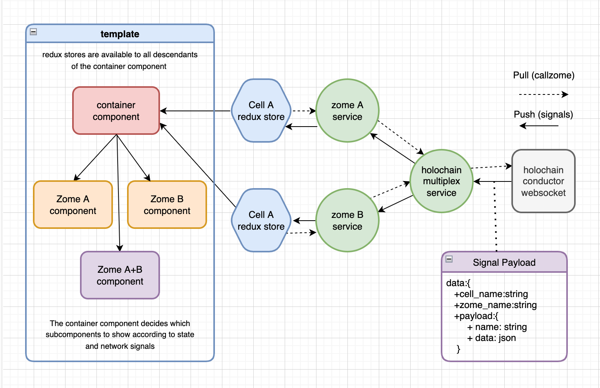

# Team-Mates
happ using invites and profiles zomes to get you started on holochain development

## Design

The UI architecture shown below should be modular and relatively easy to understand and extend.  
Each Zome has a zome service which exposes its full API and listens for network signals.
The Zome services are instanciated by the RX stores which cache data for a specific cell and zome.
The Container component holds a provider instance for each RX store, available to its sub-components 

This simple design works for a statically known number of cells which are pre-defined in the build properties
It also assumes that the signals contain meta-data pertaining to the cell and zome name and signal payloads are 
structured as {name:string, data:any}
<p align="center">
    
</p>


## Installaton

At first, run from the root folder of this repository to enter the nix-shell:

```bash
nix-shell
```

**You need to be inside this nix-shell to run any of the instructions below.**

From the root folder of the repo:

```bash
npm install
```

## Starting the UI to connect to holochain

```bash
npm start
```

## Starting a Holochain network

```bash
npm run holochain
```
or
```bash
npm run network 2
```

You can replace "2" by the number of agents that you want to boot up

## Testing (dependent on zome developers)

```bash
npm test
```


